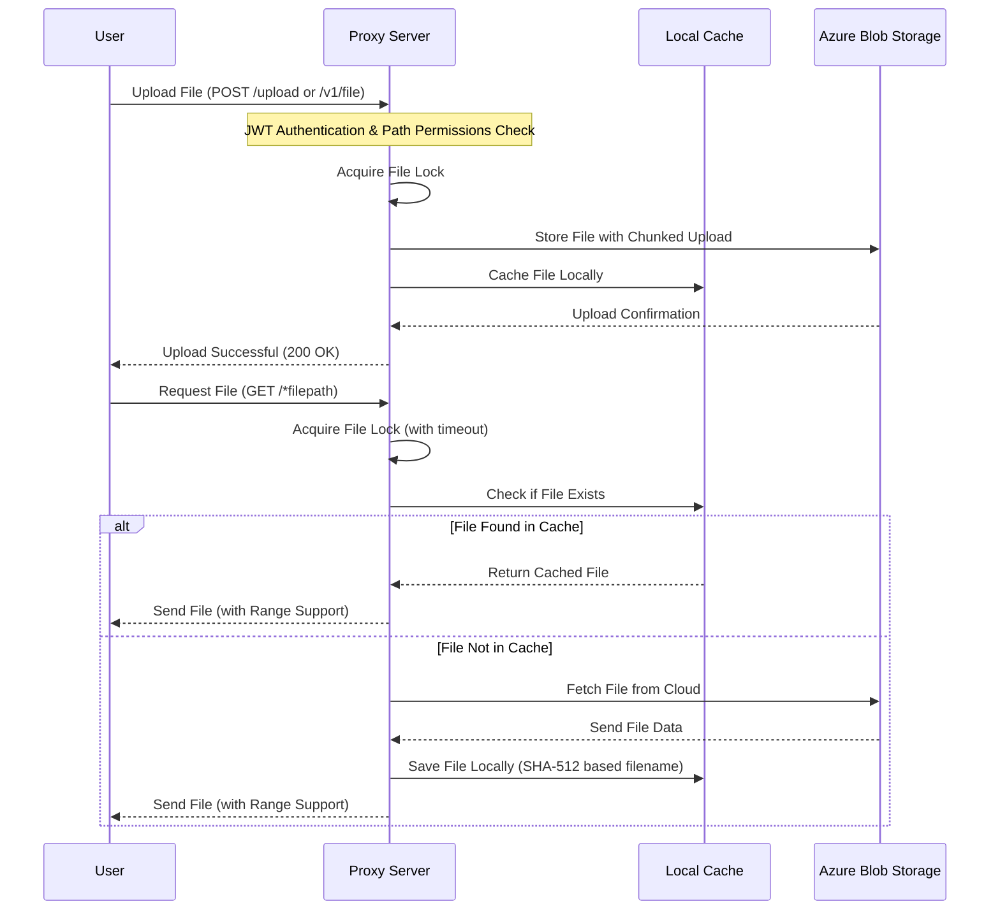

We have a simple Proxy server that supports file upload and download, with JWT token-based authentication. The server supports multiple storage backends, file caching, range requests, and provides Prometheus metrics.

## API Endpoints

### Upload

**`POST /upload`** or **`POST /v1/file`**

Upload a file to the server. Requires JWT authentication.

**Form fields:**
- `path`: The path to store the file in the server
- `file0`: The file to upload

### Download

**`GET /*filepath`**

Download a file from the server. Supports range requests for partial downloads.

### Authentication Check

**`GET /v1/checkauth`**

Validate a JWT token. Returns the authenticated user's email if valid.

### List Files

**`GET /v1/list`**

List all files in the storage (public endpoint).

### Server Status

**`GET /`**

Returns server status: "KernelCI Proxy Server"

### Metrics

**`GET /metrics`**

Prometheus metrics endpoint showing storage space and system information.

### Request a token

Ask the kernelci-sysadmin team for a token.

### Testing with curl

```bash
# Upload a file
curl -X POST https://files.kernelci.org/upload \
    -H "Authorization: Bearer <JWT_TOKEN>" \
    -F "path=testfolder" \
    -F "file0=@local_folder/local_file"

# Alternative upload endpoint
curl -X POST https://files.kernelci.org/v1/file \
    -H "Authorization: Bearer <JWT_TOKEN>" \
    -F "path=testfolder" \
    -F "file0=@local_folder/local_file"

# File will be uploaded as testfolder/local_folder/local_file

# Download a file
curl https://files.kernelci.org/testfolder/local_folder/local_file

# Download with range request (partial content)
curl -H "Range: bytes=0-1023" https://files.kernelci.org/testfolder/local_folder/local_file

# Check authentication
curl -X GET https://files.kernelci.org/v1/checkauth \
    -H "Authorization: Bearer <JWT_TOKEN>"

# List all files
curl https://files.kernelci.org/v1/list

# Get metrics
curl https://files.kernelci.org/metrics
```

## Features

- **JWT Authentication**: Secure token-based authentication for uploads
- **Multiple Storage Backends**: Currently supports Azure Blob Storage with extensible driver architecture
- **Local Caching**: Files are cached locally with automatic cleanup rules; housekeeping enforces a hard limit of 1,000,000 cached entries, deletes the oldest files in configurable batches (default 100,000 files), and frees disk space whenever available space falls below 12%
- **Range Request Support**: Partial content downloads using HTTP range requests
- **File Locking**: Prevents concurrent uploads to the same file path
- **Prometheus Metrics**: System monitoring and metrics collection
- **User Access Control**: Configurable path-based upload permissions per user
- **Content-Type Detection**: Automatic MIME type detection based on file extensions
- **HTTP Caching Headers**: ETag and Last-Modified support for efficient caching

## Architecture



## Configuration

The server supports configuration through a `config.toml` file with the following structure:

```toml
# Storage backend driver (defaults to "azure")
driver = "azure"
jwt_secret = "your-jwt-secret-here"

# Azure Blob Storage configuration
[azure]
account = "your-storage-account"
key = "your-storage-key"
container = "your-container-name"
sastoken = "?sv=2022-11-02&ss=b..."

# User access control
[[users]]
name = "user@example.com"
prefixes = ["/allowed/path1", "/allowed/path2"]

[[users]]
name = "admin@example.com"
prefixes = [""]  # Empty prefix allows access to all paths
```

### Cache Housekeeping

The cache directory is capped at 1,000,000 cached artifacts (`*.content` files). When the limit is exceeded—or when disk space drops below 12%—the housekeeping worker deletes the oldest entries in batches. The batch size defaults to 100,000 files and can be overridden in the configuration file:

```toml
[cache]
cleanup_chunk_size = 100000
```

Raising the value makes each cleanup iteration more aggressive; lowering it favors smaller, more frequent deletions.

## Environment Variables

- `STORAGE_DEBUG`: Enable debug logging
- `KCI_STORAGE_CONFIG`: Override default config file path
