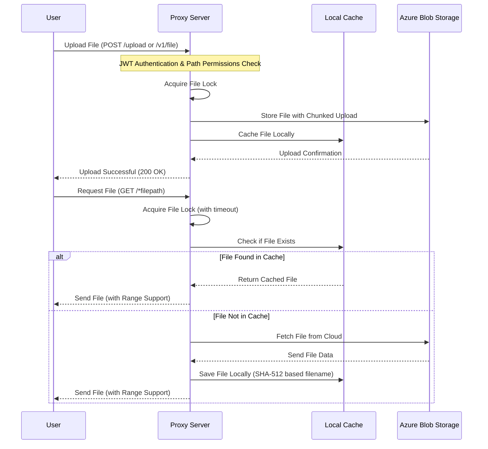

We have a simple Proxy server that supports file upload and download, with JWT token-based authentication. The server supports multiple storage backends, file caching, range requests, and provides Prometheus metrics.

## API Endpoints

### Upload

**`POST /upload`** or **`POST /v1/file`**

Upload a file to the server. Requires JWT authentication.

**Form fields:**
- `path`: The path to store the file in the server
- `file0`: The file to upload

### Archive Upload

**`POST /v1/archive`**

Upload and unpack a tar archive. Requires JWT authentication.

**Form fields:**
- `path`: The destination prefix for extracted files
- `archive`: The `.tar`, `.tar.gz`, `.tgz`, `.tar.zst`, `.tzst`, `.tar.xz`, or `.txz` archive to upload

Only regular files are accepted from the archive. Absolute paths, parent-directory traversal, links, devices, and other special entries are rejected. Extracted files are uploaded as normal backend objects with the same owner and retention handling as single-file uploads. The server uploads extracted files with limited parallelism (default 16); set `KCI_STORAGE_ARCHIVE_PARALLELISM` to tune it.

The request completes only after every extracted file has been uploaded to the backend, so large archives (e.g. ~1k files) can take minutes. If the endpoint sits behind a reverse proxy, raise the proxy's upstream header/read timeout for `/v1/archive` accordingly — for nginx, `proxy_read_timeout` (default 60s) is what triggers `upstream timed out while reading response header`. Higher `KCI_STORAGE_ARCHIVE_PARALLELISM` reduces the wall-clock time but raises peak memory (each concurrent upload holds a 10MB chunk buffer).

### Download

**`GET /*filepath`**

Download a file from the server. Supports range requests for partial downloads.

### Authentication Check

**`GET /v1/checkauth`**

Validate a JWT token. Returns the authenticated user's email if valid.

### List Files

**`GET /v1/list`**

List all files in the storage (public endpoint).

### Server Status

**`GET /`**

Returns server status: "KernelCI Proxy Server"

### Metrics

**`GET /metrics`**

Prometheus metrics endpoint showing storage space and system information.

### Request a token

Ask the kernelci-sysadmin team for a token.

### Testing with curl

```bash
# Upload a file
curl -X POST https://files.kernelci.org/upload \
    -H "Authorization: Bearer <JWT_TOKEN>" \
    -F "path=testfolder" \
    -F "file0=@local_folder/local_file"

# Alternative upload endpoint
curl -X POST https://files.kernelci.org/v1/file \
    -H "Authorization: Bearer <JWT_TOKEN>" \
    -F "path=testfolder" \
    -F "file0=@local_folder/local_file"

# File will be uploaded as testfolder/local_folder/local_file

# Bulk upload many files
tar -cJf dtbs.tar.xz -C local_folder/dtbs .
curl -X POST https://files.kernelci.org/v1/archive \
    -H "Authorization: Bearer <JWT_TOKEN>" \
    -F "path=testfolder/dtbs" \
    -F "archive=@dtbs.tar.xz"

# Download a file
curl https://files.kernelci.org/testfolder/local_folder/local_file

# Download with range request (partial content)
curl -H "Range: bytes=0-1023" https://files.kernelci.org/testfolder/local_folder/local_file

# Check authentication
curl -X GET https://files.kernelci.org/v1/checkauth \
    -H "Authorization: Bearer <JWT_TOKEN>"

# List all files
curl https://files.kernelci.org/v1/list

# Get metrics
curl https://files.kernelci.org/metrics
```

## Features

- **JWT Authentication**: Secure token-based authentication for uploads
- **Multiple Storage Backends**: Currently supports Azure Blob Storage with extensible driver architecture
- **Local Caching**: Files are cached locally with automatic cleanup rules; housekeeping enforces a hard limit of 1,000,000 cached entries, deletes the oldest files in configurable batches (default 100,000 files), and frees disk space whenever available space falls below 12%
- **Range Request Support**: Partial content downloads using HTTP range requests
- **File Locking**: Prevents concurrent uploads to the same file path
- **Prometheus Metrics**: System monitoring and metrics collection
- **User Access Control**: Configurable path-based upload permissions per user
- **Content-Type Detection**: Automatic MIME type detection based on file extensions
- **HTTP Caching Headers**: ETag and Last-Modified support for efficient caching

## Architecture


```mermaid
sequenceDiagram
    participant User
    participant Proxy Server
    participant Local Cache
    participant Azure Blob Storage

    %% Upload Flow
    User->>Proxy Server: Upload File (POST /upload or /v1/file)
    Note over Proxy Server: JWT Authentication & Path Permissions Check
    Proxy Server->>Proxy Server: Acquire File Lock
    Proxy Server->>Azure Blob Storage: Store File with Chunked Upload
    Proxy Server->>Local Cache: Cache File Locally
    Azure Blob Storage-->>Proxy Server: Upload Confirmation
    Proxy Server-->>User: Upload Successful (200 OK)

    %% Download Flow
    User->>Proxy Server: Request File (GET /*filepath)
    Proxy Server->>Proxy Server: Acquire File Lock (with timeout)
    Proxy Server->>Local Cache: Check if File Exists
    alt File Found in Cache
        Local Cache-->>Proxy Server: Return Cached File
        Proxy Server-->>User: Send File (with Range Support)
    else File Not in Cache
        Proxy Server->>Azure Blob Storage: Fetch File from Cloud
        Azure Blob Storage-->>Proxy Server: Send File Data
        Proxy Server->>Local Cache: Save File Locally (SHA-512 based filename)
        Proxy Server-->>User: Send File (with Range Support)
    end
```

## Configuration

The server supports configuration through a `config.toml` file with the following structure:

```toml
# Storage backend driver (defaults to "azure")
driver = "azure"
jwt_secret = "your-jwt-secret-here"

# Optional IPv4/IPv6 networks to reject before request handling
block_subnets = ["192.0.2.0/24", "198.51.100.0/24", "2001:db8::/32"]

# Azure Blob Storage configuration
[azure]
account = "your-storage-account"
key = "your-storage-key"
container = "your-container-name"
sastoken = "?sv=2022-11-02&ss=b..."

# User access control
[[users]]
name = "user@example.com"
prefixes = ["/allowed/path1", "/allowed/path2"]

[[users]]
name = "admin@example.com"
prefixes = [""]  # Empty prefix allows access to all paths
```

`block_subnets` is a top-level array of CIDR strings. Use `/32` for one IPv4
address or `/128` for one IPv6 address. Matching requests receive `403
Forbidden` and produce an `event=subnet_ban` warning log. Invalid CIDRs prevent
startup; restart the server after changing the list.

### Browser Download Challenge

An optional first-party cookie challenge can be enabled for selected
case-insensitive User-Agent substrings:

```toml
[download_challenge]
user_agents = ["android"]
secret = "replace-with-an-independent-random-secret-of-at-least-32-characters"
cookie_ttl_seconds = 600
ipv4_prefix_length = 24
ipv6_prefix_length = 64
fallback_bytes_per_second = 262144
secure_cookie = true
```

The section is optional: when it is absent, or when `user_agents` is empty,
downloads behave exactly as before. A matching browser receives a small
no-store preparation page, obtains a signed cookie bound to its client subnet,
and reloads the artifact. The optional fallback is delivered with
`X-Accel-Limit-Rate` for Nginx bandwidth limiting. Use a separate random secret
and keep `secure_cookie` enabled outside local plain-HTTP development.

### Cache Housekeeping

The cache directory is capped at 1,000,000 cached artifacts (`*.content` files). When the limit is exceeded—or when disk space drops below 12%—the housekeeping worker deletes the oldest entries in batches. The batch size defaults to 100,000 files and can be overridden in the configuration file:

```toml
[cache]
cleanup_chunk_size = 100000
```

Raising the value makes each cleanup iteration more aggressive; lowering it favors smaller, more frequent deletions.

### Upload Retention Tagging

The server can tag every new upload with a retention marker so the storage backend can expire old files. The feature is disabled unless the `[retention]` section is present:

```toml
[retention]
tag_key = "retention"  # optional, defaults to "retention"
tag_value = "6m"
```

With the Azure backend, each upload gets a blob index tag (e.g. `retention=6m`) next to the existing `owner` tag. Deletion itself is performed by an Azure lifecycle management policy on the storage account that matches the tag — only tagged (i.e. new) blobs are affected:

```json
{
  "rules": [
    {
      "enabled": true,
      "name": "expire-tagged-uploads",
      "type": "Lifecycle",
      "definition": {
        "actions": {
          "baseBlob": {
            "delete": { "daysAfterModificationGreaterThan": 180 }
          }
        },
        "filters": {
          "blobTypes": ["blockBlob"],
          "blobIndexMatch": [
            { "name": "retention", "op": "==", "value": "6m" }
          ]
        }
      }
    }
  ]
}
```

With the local backend, the tag is recorded as a `tag-retention:6m` line in the file's metadata sidecar, so a retention cleaner can identify expirable files.

## Environment Variables

- `STORAGE_DEBUG`: Enable debug logging
- `KCI_STORAGE_CONFIG`: Override default config file path
